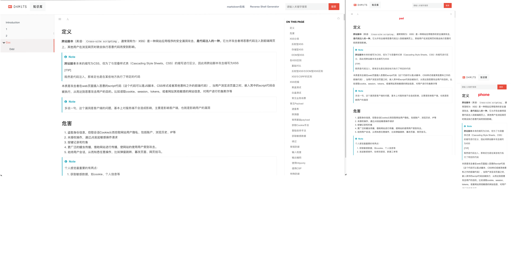

## 说明

基于[door](https://github.com/key7men/gitbook-plugin-theme-door)的二次开发，主要开发内容如下：

* 完善`book.json`
* 增加移动端适配
* 更新目录栏追随和多级目录栏
* 增加了菜单栏滚动和目录栏滚动

## gitbook-plugin-theme-d4t

> 含有Header导航，Sidebar导航以及MiniMap导航的gitbook主题。

### 主题样式


### 使用方式

编写`book.json`文件如下

```json
{
    "title": "d4m1ts 知识库",
    "author": "d4m1ts",
    "description": "个人的部分知识技能，倾向于使用知识库的方式进行总结回顾自己",
    "theme-default":
    {
        "showLevel": true
    },
    "plugins":
    [
        "splitter",
        "hide-element",
        "code",
        "theme-d4t",
        "-lunr",
        "-search",
        "-sharing",
        "search-pro-fixed",
        "-highlight",
        "chapter-fold",
        "expandable-chapters",
        "lightbox",
        "donate",
        "tbfed-pagefooter",
        "github",
        "flexible-alerts",
        "prism",
        "back-to-top-button",
        "auto-scroll-table"
    ],
    "variables":
    {
        "d4t":
        {
            "nav":
            [
                {
                    "url": "https://markdown.gm7.org/",
                    "target": "_blank",
                    "name": "markdown在线"
                },
                {
                    "url": "https://rshell.gm7.org/",
                    "target": "_blank",
                    "name": "Reverse Shell Generator"
                }
            ]
        }
    },
    "pluginsConfig":
    {
        "hide-element":
        {
            "elements":
            [
                ".gitbook-link",
                ".title",
                ".treeview__copyright",
                ".treeview__main-title"
            ]
        },
        "d4t":
        {
            "search-placeholder": "请输入关键字搜索",
            "logo": "/README.assets/logo.svg",
            "favicon": "/README.assets/favicon.ico"
        },
        "donate":
        {
            "wechat": "/README.assets/gzh_0.png",
            "alipay": "/README.assets/gzh_1.png",
            "title": "",
            "button": "支持作者",
            "alipayText": "点点广告🙏",
            "wechatText": "关闭Adblock"
        },
        "tbfed-pagefooter":
        {
            "copyright": "Copyright &copy d4m1ts 2023",
            "modify_label": "该文章修订时间：",
            "modify_format": "YYYY-MM-DD HH:mm:ss"
        },
        "github":
        {
            "url": "https://github.com/damit5"
        },
        "flexible-alerts":
        {
            "style": "callout",
            "comment":
            {
                "label": "Comment",
                "icon": "fa fa-comments",
                "className": "info"
            }
        },
        "prism":
        {
            "css":
            [
                "prismjs/themes/prism-tomorrow.css"
            ],
            "lang":
            {
                "flow": "typescript"
            },
            "ignore":
            [
                "mermaid",
                "eval-js",
                "ascii",
                "result",
                "manifest",
                "payload",
                "google",
                "tree",
                "java_out",
                "log4j2",
                "jsp",
                "class",
                "Exception",
                "stack",
                "c#",
                "xml-dtd",
                "C++",
                "twig",
                "jinja2",
                "exception",
                "tpl"
            ]
        }
    }
}
```

安装启动

```shell
gitbook install
gitbook serve
```

